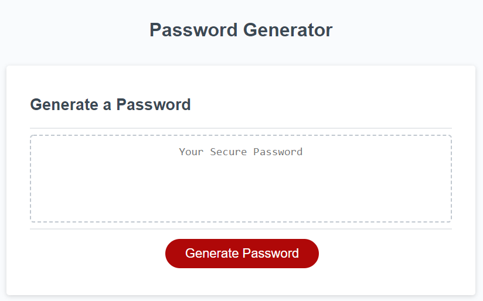
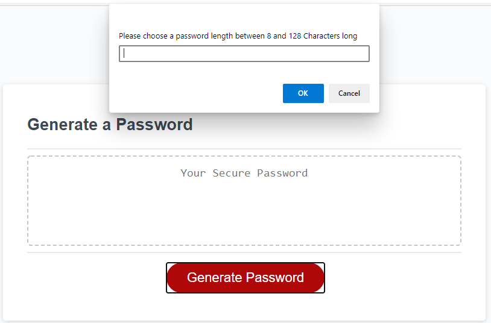
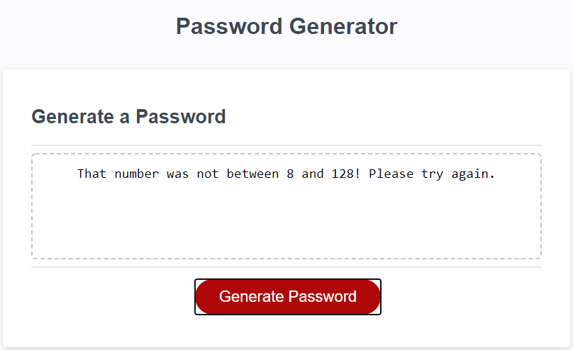
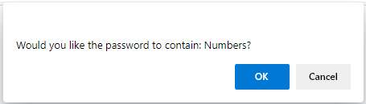
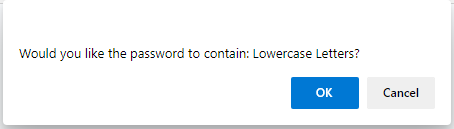
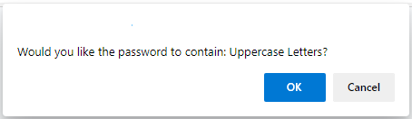
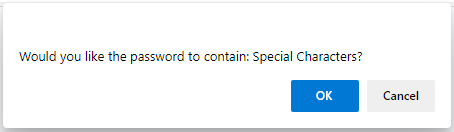
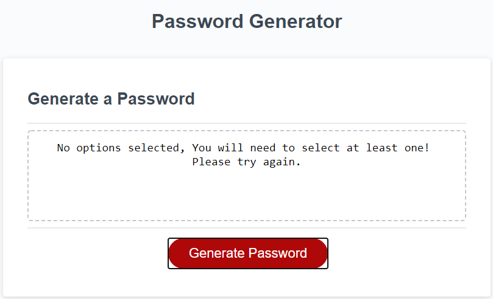
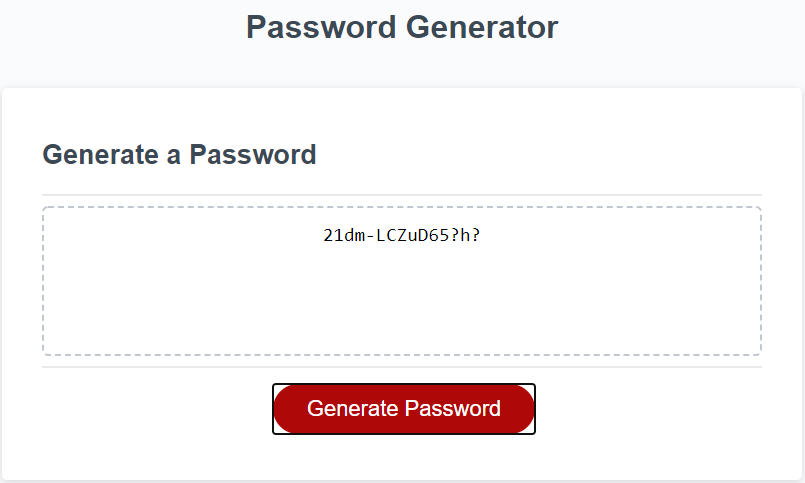

# Random Password Generator

*   GitHub Repository [randomPwdGen](https://github.com/Loosekonnection/randomPwdGen)
*   GitHub Pages URL [Password Generator Webpage](https://loosekonnection.github.io/randomPwdGen/)
---

 

## Pseudo Code

*   The Password Generator must return a random password based on a series of questions/prompts to the end user after the end user clicks the 'Generate Password' button.

*   The questions the end user must answer to successfully generate a password are:

    *   Q1: Please choose a password length between 8 and 128 characters long.
    *   Q2: Should the password contain Numbers?
    *   Q3: Should the password contain Lowercase Letters?
    *   Q4: Should the password contain Uppercase Letters?
    *   Q5: Should the password contain Special Characters?

*   Q1: Please choose a password length between 8 and 128 characters long.

    *   The user must be advised of the minimum and maximum character choice available.
    *   If the number input by the end user is outside of 8 - 128, the user must be prompted to try again.
    *   If the number input by the end user is between 8 and 128, the next question must be presented.

*   Q2-Q5: These questions are of Yes or No choice, for this a true or false confirm can be used.

    *   If the answer to any of these questions is True, the respective characters need to be in the randomly generated password.
    *   If the answer to any of these questions is false, we need to filter/excluded these from the randomly generated password.
    *   If a user chooses false to all of these questions, no password can be generated. The page will then need to notify the end user that they must at a minimum include at least one of the character types or the password to be generated.

---

 

## Technolgies Used

*   HMTL [w3schools.com Learn HTML](https://www.w3schools.com/html/default.asp)
*   CSS [w3schools.com Learn CSS](https://www.w3schools.com/css/default.asp)
*   JavaScript [w3schools.com JavaScript Tutorial](https://www.w3schools.com/js/default.asp)
---

 

##  Using the Password Generator

*   To generate a random password, click the red 'Generate Password' button:

*   Clicking the red 'Generate Password' button will prompt for the end user to enter a number between 8 and 128.

* If the number entered is not between 8 and 128, the end user is notified to try again.

*   If the number entered is between 8 and 128, the end user is prompted with a series of prompts asking which types of characters the end user can choose to or not to include in their required password.

*   If the end user does not choose any character type, the password cannot be generated and the end user is notified to try again.

*   If the end user successfully chooses some characters the password is randomly generated and presented to the screen.

---

 

## Credits

*   University of Birmingham [Coding Boot Camp](https://bootcamp.birmingham.ac.uk/coding/)

*   Chigbo Onyinyechukwu [LinkedIn](https://www.linkedin.com/in/nnadi-onyinyechukwu-73726953/)

*   Paul Iurea [LinkedIn](https://www.linkedin.com/in/paul-iurea/)

* Ben Ashley [LinkedIn](https://www.linkedin.com/in/bashley1/)

*   ASCII Table for CharCodes [Ohio State Education](https://www.asc.ohio-state.edu/demarneffe.1/LING5050/material/characters.html)

*   Math.floor & Math.random [The Net Ninja](https://www.youtube.com/channel/UCW5YeuERMmlnqo4oq8vwUpg)

*   Most of the answers to my research on this project have come from [Stack Overflow](https://stackoverflow.com/), it has been my main go to for help with almost all of my coding queries.

* For syntax help when finding a solution elsewhere [w3schools.com](https://www.w3schools.com/jsref/default.asp) is and has been a fantastic reference guide.
---
 

 

---
© 2021 Loosekonnection, Working towards being a Full Stack Dev.

